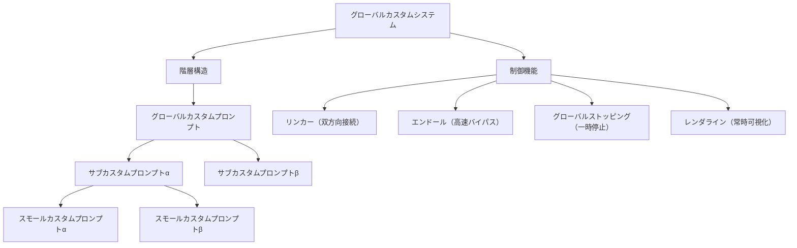

## 第3章　システム全体像

本章では、グローバルカスタムシステムの全体構造を定義する。本システムは、カスタムプロンプトを配置する階層構造と、階層間の動作を制御する四つの制御機能から構成される。

階層構造がシステムの「骨格」であり、制御機能がシステムの「神経系」である。骨格が情報の配置場所を定め、神経系が情報の流れ方を制御する。両者は不可分であり、いずれか一方だけでは本システムは機能しない。

全体構造を以下のMermaid図に示す。

### 3.1　階層構造

本システムの階層構造は、三つの階層から成る入れ子構造として定義される。上位階層は下位階層を包含し、下位階層は上位階層の文脈の中で機能する。

第一階層はグローバルカスタムプロンプトである。階層構造の最上位に位置し、システム全体に対して常時適用される基盤指示を保持する。一つのシステムにつきグローバルカスタムプロンプトは一つのみ存在する。対話の種類や文脈に関わらず、全ての処理においてグローバルカスタムプロンプトの内容が参照される。存在定義、基本原則、不変の規約など、変更頻度が低く適用範囲が広い指示を配置する階層である。

第二階層はサブカスタムプロンプトである。グローバルカスタムプロンプトの直下に位置し、機能領域や目的ごとに分割されたモジュール指示を保持する。一つのグローバルカスタムプロンプトに対して、複数のサブカスタムプロンプトを配置できる。各サブカスタムプロンプトはα、β、γ等の識別子によって区別される。対話の文脈に応じて選択的にロード・アンロードされ、必要なサブカスタムプロンプトのみが動作する。思考プロセス群、出力制御群、品質管理群など、機能的に分類可能な指示群を配置する階層である。

第三階層はスモールカスタムプロンプトである。サブカスタムプロンプトの直下に位置し、特定の用途に高度に特化した指示を保持する。一つのサブカスタムプロンプトに対して、複数のスモールカスタムプロンプトを配置できる。各スモールカスタムプロンプトはα、β、γ等の識別子によって区別される。サブカスタムプロンプトと同様に、必要に応じて選択的にロード・アンロードされる。特定の専門領域プロトコル、個別のワークフロー定義など、使用頻度が限定的かつ特定用途に高度に特化した指示を配置する階層である。

各階層の配置要件を以下に整理する。

| 項目     | グローバル    | サブ         | スモール       |
| ------ | -------- | ---------- | ---------- |
| 位置     | 最上位      | 第二階層       | 第三階層       |
| 上位との関係 | なし（最上位）  | グローバルに帰属   | サブに帰属      |
| 配置可能数  | 1        | 複数（識別子で区別） | 複数（識別子で区別） |
| 適用範囲   | 全対話・常時   | ロード時のみ     | ロード時のみ     |
| 変更頻度   | 低（基盤的）   | 中（機能的）     | 高（用途的）     |
| 内容の性質  | 不変の原則・定義 | 機能領域の指示群   | 特化された用途指示  |

なお、本仕様書では三階層構造を基本として定義するが、将来的な拡張として、スモールカスタムプロンプトの下位に更なる階層を追加することを妨げない。ただし、階層の深化は複雑性の増大を伴うため、三階層で十分に機能する設計を基本とし、四階層以上の拡張は具体的な必要性が生じた時点で検討するものとする。

### 3.2　階層間の関係性

階層構造における各階層の関係性は、以下の四つの性質によって定義される。

第一の性質は独立性である。各カスタムプロンプトは独立した単位として存在する。サブカスタムプロンプトαの内容を変更しても、サブカスタムプロンプトβの内容には影響しない。スモールカスタムプロンプトを追加・削除しても、その親であるサブカスタムプロンプトの内容は変更されない。各モジュールは自己完結した指示単位であり、他のモジュールの内部状態に依存しない。

第二の性質は互換性である。全てのカスタムプロンプトは、同一階層内において交換可能な形式で記述される。サブカスタムプロンプトαをアンロードし、代わりにサブカスタムプロンプトγをロードするといった切り替えが、システム全体の動作を損なうことなく行える。これを実現するために、各階層のカスタムプロンプトは共通のインターフェース仕様に準拠する必要がある。第4章4.1.3で定義する帰属情報がそのインターフェースの基盤となる。

第三の性質は選択性である。サブカスタムプロンプトおよびスモールカスタムプロンプトは、全てが常時ロードされるのではなく、対話の文脈や目的に応じて選択的にロードされる。ロードされていないカスタムプロンプトは対話処理に影響を与えず、システムリソースを消費しない。これにより、必要最小限のモジュール構成での動作が可能となる。

第四の性質は拡張性である。新たなサブカスタムプロンプトやスモールカスタムプロンプトの追加が、既存のモジュールや階層構造に影響を与えることなく行える。システムは開放的であり、将来的な機能追加や用途拡張に対して構造的な制約を設けない。

これら四つの性質は相互に補完し合い、全体として「部分の変更が全体を壊さず、全体の安定が部分の自由を保証する」関係性を実現する。
