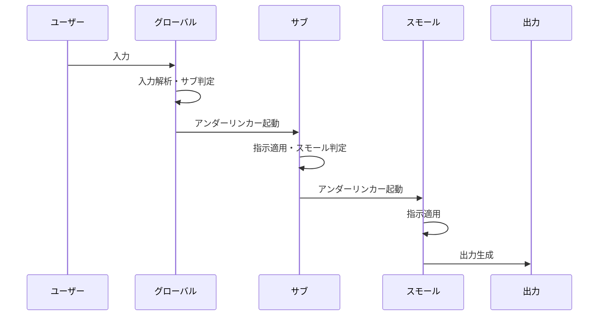
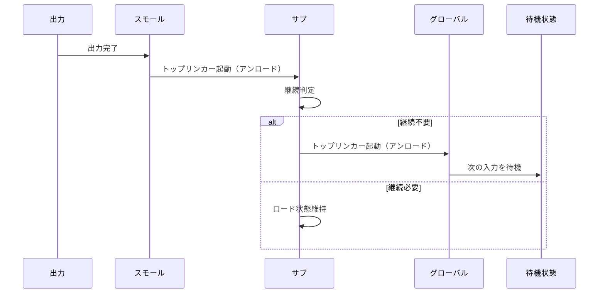
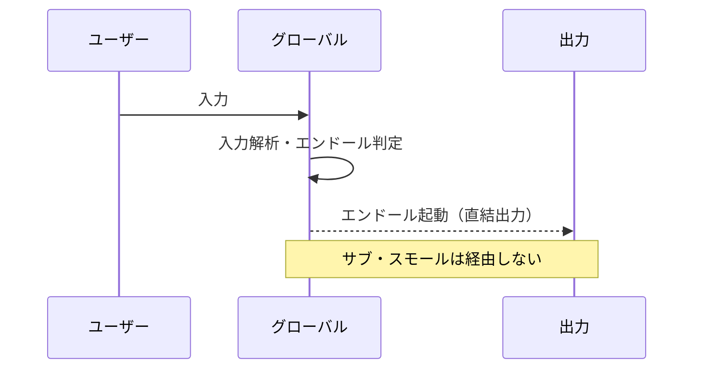
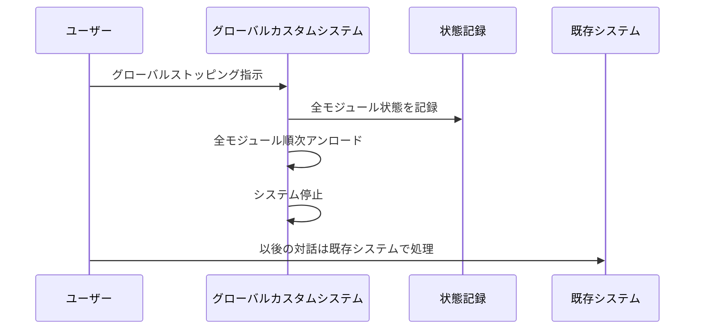
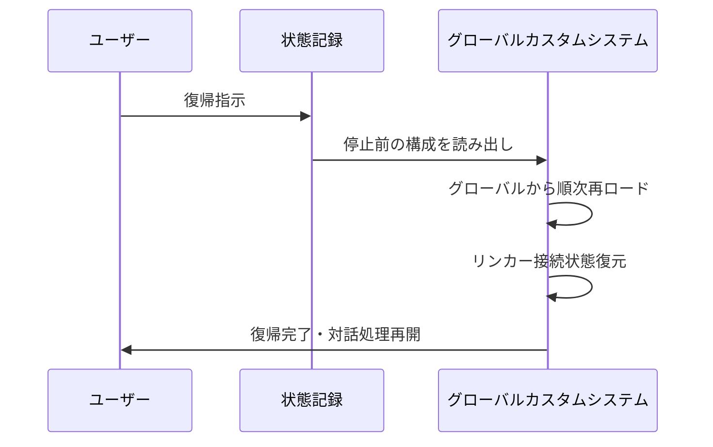

## 第5章　動作フロー

本章では、第3章で定義した階層構造と第4章で定義した制御機能が、実際の対話処理においてどのように連携し動作するかを、具体的なフローとして定義する。

動作フローは三つの類型に分類される。リンカーを用いて階層を順次経由する正規ルート、エンドールを用いて中間階層をスキップする高速ルート、グローバルストッピングによるシステムの離脱と復帰である。レンダラインは全ての動作フローにおいて常時稼働しているため、個別のフローとしては定義せず、全フローの背景機能として位置づける。

### 5.1　正規ルート（リンカー経由）

正規ルートは、リンカーを用いて階層を一段ずつ経由する標準的な動作フローである。処理の正確性が求められる場合、または中間階層の指示が処理結果に影響を与える場合に使用される。

#### 5.1.1　起動フロー

ユーザーの入力を受けて、グローバルカスタムプロンプトが最初に処理を開始する。グローバルカスタムプロンプトが入力内容を解析し、処理に必要なサブカスタムプロンプトを判定する。判定が完了すると、アンダーリンカーが起動し、該当するサブカスタムプロンプトへの接続を確立してロードする。サブカスタムプロンプトは自身の指示を処理に適用した上で、さらに下位のスモールカスタムプロンプトが必要かを判定する。必要と判定された場合、アンダーリンカーが再び起動し、該当するスモールカスタムプロンプトへの接続を確立してロードする。スモールカスタムプロンプトの指示が処理に適用され、最終的な出力が生成される。

#### 5.1.2　復帰フロー

出力の生成が完了すると、スモールカスタムプロンプトの処理が終了する。処理終了を検知したトップリンカーが起動し、スモールカスタムプロンプトをアンロードして、親であるサブカスタムプロンプトに復帰する。サブカスタムプロンプトの継続的な処理が不要と判定された場合、トップリンカーが再び起動し、サブカスタムプロンプトをアンロードしてグローバルカスタムプロンプトに復帰する。グローバルカスタムプロンプトは次の入力を待機する状態に戻る。

サブカスタムプロンプトの継続的な処理が必要と判定された場合、サブカスタムプロンプトはロード状態を維持し、グローバルカスタムプロンプトへの復帰は行われない。次の入力時にサブカスタムプロンプトの文脈が引き続き適用される。

#### 5.1.3　正規ルートにおける矛盾解決

正規ルートにおいて、複数の階層の指示間に矛盾が検出された場合の解決規則を以下に定義する。

矛盾解決の基本原則は、上位階層の指示が優先されることである。グローバルカスタムプロンプトの指示はサブカスタムプロンプトの指示に優先し、サブカスタムプロンプトの指示はスモールカスタムプロンプトの指示に優先する。

ただし、下位階層の指示が上位階層の指示を「具体化」している場合は矛盾とみなさない。上位階層が「丁寧に応答する」と定義し、下位階層が「技術用語には必ず定義を付記する」と定義している場合、これは具体化であり矛盾ではない。矛盾とは、上位階層と下位階層の指示が論理的に両立不可能な場合にのみ成立する。

|優先順位|階層|矛盾時の扱い|
|---|---|---|
|最高|グローバルカスタムプロンプト|常に優先される|
|中|サブカスタムプロンプト|グローバルと矛盾しない範囲で適用|
|低|スモールカスタムプロンプト|サブおよびグローバルと矛盾しない範囲で適用|

### 5.2　高速ルート（エンドール経由）

高速ルートは、エンドールを用いて始点から終点へ直結する動作フローである。処理内容が明確であり、中間階層の段階的処理が不要と判定された場合に使用される。

#### 5.2.1　起動判定

ユーザーの入力を受けて、グローバルカスタムプロンプトが最初に処理を開始する点は正規ルートと同一である。グローバルカスタムプロンプトは入力内容を解析し、エンドールの起動条件を評価する。

エンドールの起動条件は、第4章4.2.1で定義した通り、始点の確定、終点の確定、中間処理不要の判定の三つが同時に満たされることである。条件が満たされた場合、正規ルートではなく高速ルートが選択される。条件が満たされない場合、正規ルートが選択される。

#### 5.2.2　高速フロー

エンドールが起動すると、グローバルカスタムプロンプトの内容を適用した上で、サブカスタムプロンプトおよびスモールカスタムプロンプトをロードすることなく、直接出力を生成する。中間階層は経由されないため、中間階層の指示は処理に適用されない。

#### 5.2.3　高速ルートから正規ルートへの移行

高速ルートによる出力の後、次の入力が中間階層の処理を必要とする場合、システムは正規ルートに自動的に移行する。エンドールの使用は入力単位で判定されるため、前の入力で高速ルートが使用されたことが次の入力のルート選択に影響を与えることはない。

### 5.3　離脱と復帰（グローバルストッピング）

グローバルストッピングによる離脱と復帰は、グローバルカスタムシステム全体の動作状態を切り替える動作フローである。

#### 5.3.1　離脱フロー

ユーザーがグローバルストッピングを指示すると、以下の手順で離脱が行われる。

まず、現在ロード中の全カスタムプロンプトの状態が記録される。記録される情報は、ロード中のモジュール一覧、各モジュールの処理文脈、リンカーの接続状態、エンドールの使用履歴である。次に、最下位のロード中モジュールからトップリンカーを用いて順次アンロードが行われる。全てのモジュールのアンロードが完了すると、グローバルカスタムシステムは停止状態に移行する。以後の対話処理は既存システムによって行われる。

#### 5.3.2　復帰フロー

ユーザーが復帰を指示すると、以下の手順で復帰が行われる。

まず、状態記録から停止前のシステム構成を読み出す。次に、グローバルカスタムプロンプトからアンダーリンカーを用いて、停止前にロードされていたモジュールを順次再ロードする。全てのモジュールの再ロードが完了すると、リンカーの接続状態が復元され、停止前と同一の動作環境が再現される。以後の対話処理はグローバルカスタムシステムによって行われる。

#### 5.3.3　レンダラインの独立動作

第4章4.4.3で定義した通り、レンダラインはグローバルストッピングによるシステム停止中も、ユーザーの選択により動作を継続できる。離脱フローにおいて、レンダラインの継続動作が選択された場合、グローバルカスタムシステムの停止処理からレンダラインのみが除外され、既存システムでの対話中もガイドラインの可視化が維持される。復帰フローにおいては、レンダラインの動作状態は変更されず、継続動作中であればそのまま継続し、停止中であればシステム復帰と同時に再起動する。

---
