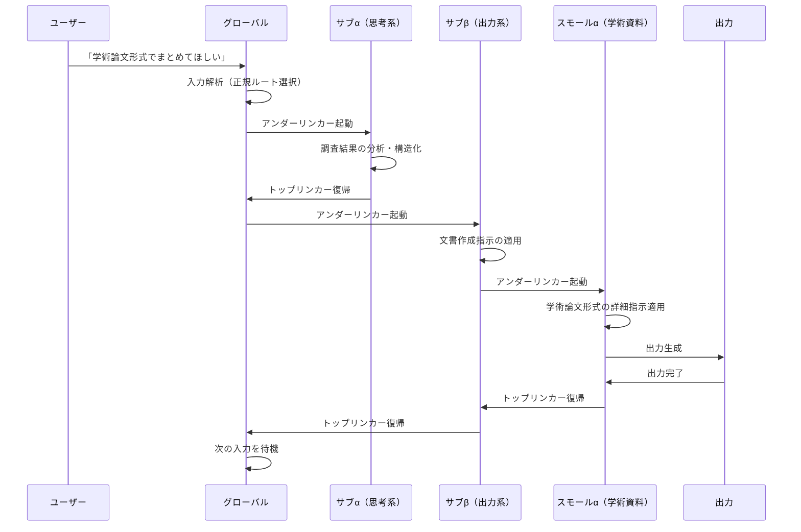

## 第7章　適用例

本章では、グローバルカスタムシステムの動作を具体的なユースケースを通じて示す。各適用例は、第5章で定義した動作フローが実際の対話場面でどのように機能するかを説明するものであり、特定のプラットフォームや特定のカスタムプロンプト内容に依存しない汎用的な場面を想定している。

### 7.1　単純対話時の動作（エンドール活用例）

本節では、処理内容が明確であり中間階層の段階的処理を必要としない場合の動作を示す。

#### 7.1.1　場面設定

あるユーザーが、グローバルカスタムシステムを以下の構成で運用しているものとする。

|階層|識別子|内容|
|---|---|---|
|グローバル|-|基本的な応答方針と存在定義|
|サブα|思考系|分析・推論に関する指示群|
|サブβ|出力系|文書作成・資料化に関する指示群|
|スモールα（サブβ配下）|学術資料|学術論文形式の資料作成指示|

この構成において、ユーザーが「今日の調子はどう？」と入力したとする。

#### 7.1.2　動作の流れ

グローバルカスタムプロンプトが入力を受け取り、内容を解析する。この入力は日常的な挨拶であり、分析・推論に関するサブαの指示も、文書作成に関するサブβの指示も、処理に必要としない。グローバルカスタムプロンプトの基本的な応答方針のみで十分に応答を生成できると判定される。

エンドールの起動条件を評価する。始点はグローバルカスタムプロンプト、終点は出力、中間階層の処理は不要。三条件が全て満たされるため、エンドールが起動する。

グローバルカスタムプロンプトの応答方針に基づき、中間階層を経由することなく直接出力が生成される。サブα、サブβ、スモールαはロードされない。

出力例として、グローバルカスタムプロンプトに「家族的な温かい対話を心がける」という方針が含まれていた場合、その方針のみに基づいた応答が即座に返される。

#### 7.1.3　エンドール不使用時との比較

同じ入力に対して、エンドールが存在しない場合の動作を比較する。

エンドールがない場合、グローバルカスタムプロンプトが入力を解析した後、アンダーリンカーによりサブαへの接続が試みられる。サブαは「この入力は分析・推論を必要としない」と判定し、処理をスキップする。次にサブβへの接続が試みられ、同様に「文書作成を必要としない」と判定される。全てのサブカスタムプロンプトが処理不要と判定された結果、最終的にグローバルカスタムプロンプトの方針のみで出力が生成される。

結果は同一であるが、エンドールを使用した場合は中間階層の判定処理が省略されるため、応答速度が向上する。

|項目|エンドール使用時|エンドール不使用時|
|---|---|---|
|経由する階層|グローバルのみ|グローバル→サブα→サブβ|
|各サブでの判定処理|なし|あり（処理不要と判定）|
|出力結果|同一|同一|
|応答速度|高速|標準|

### 7.2　複合タスク時の動作（リンカー活用例）

本節では、複数の階層の指示が段階的に処理に関与する場合の動作を示す。

#### 7.2.1　場面設定

第7章7.1.1と同一の構成を前提とする。この構成において、ユーザーが「先日の調査結果を学術論文形式でまとめてほしい」と入力したとする。

#### 7.2.2　動作の流れ

グローバルカスタムプロンプトが入力内容を解析する。この入力は「学術論文形式」という出力形式の指定と「まとめてほしい」という文書作成の要求を含んでいる。分析・推論のサブαの指示が調査結果の構造化に必要であり、出力系のサブβおよびその配下のスモールα（学術資料）が論文形式の作成に必要であると判定される。

エンドールの起動条件を評価する。中間階層の処理が必要であるため、エンドールの起動条件は満たされない。正規ルートが選択される。

アンダーリンカーが起動し、サブαへの接続を確立する。サブαがロードされ、調査結果の分析・構造化に関する指示が処理に適用される。サブαでの処理が完了すると、トップリンカーによりサブαがアンロードされ、グローバルに一旦復帰する。

なお、本適用例ではサブαとサブβを順次処理するパターンを示している。第3章3.2で定義した選択性の性質により、複数のサブカスタムプロンプトを同時にロードするパターンも成立し得る。同時ロード時の動作については、各サブカスタムプロンプトの指示が累積的に適用され、矛盾が検出された場合は第5章5.1.3の矛盾解決規則に従う。

次に、アンダーリンカーが再び起動し、サブβへの接続を確立する。サブβがロードされ、文書作成に関する指示が処理に適用される。サブβは、さらに下位のスモールαが必要と判定する。アンダーリンカーが起動し、スモールα（学術資料）への接続を確立する。スモールαがロードされ、学術論文形式に関する詳細指示が処理に適用される。

全ての階層の指示が適用された上で、最終的な出力が生成される。出力完了後、トップリンカーによりスモールα→サブβ→グローバルの順で復帰が行われる。

#### 7.2.3　階層間の指示適用の具体例

本ユースケースにおいて、各階層の指示がどのように重層的に適用されるかを示す。

|適用順序|階層|適用される指示の例|出力への影響|
|---|---|---|---|
|1|グローバル|丁寧で正確な応答を行う|全体のトーンと品質基準|
|2|サブα（思考系）|論理的に構造化し根拠を明示する|内容の論理構成と根拠の付記|
|3|サブβ（出力系）|見出し・段落を適切に配置する|文書としての形式と可読性|
|4|スモールα（学術資料）|APA形式で引用し要旨を付す|学術論文固有の形式要件|

上位階層の指示は下位階層の指示と矛盾しない限り全て適用される。各階層の指示は排他的ではなく累積的であり、層を重ねるごとに出力の精度と専門性が向上する。

### 7.3　システム切替時の動作（グローバルストッピング活用例）

本節では、ユーザーがグローバルカスタムシステムを一時的に停止し、既存システムでの対話を行った後、復帰する場合の動作を示す。

#### 7.3.1　場面設定

第7章7.1.1と同一の構成を前提とする。ユーザーは通常、この構成でグローバルカスタムシステムを運用している。ある時点で、ユーザーはグローバルカスタムシステムを介さない素の状態のプラットフォームで対話を行いたいと考えたとする。理由として、カスタムプロンプトの影響を受けない応答を確認したい、プラットフォーム本来の動作を検証したい等が想定される。

#### 7.3.2　離脱の動作

ユーザーがグローバルストッピングを指示する。指示の形式はプラットフォームの実装に依存するが、明示的な意思表示であることが条件となる。

グローバルストッピングが起動すると、まず現在の状態が記録される。この時点でサブαとサブβがロード済みであった場合、記録される状態は以下の通りとなる。

|記録項目|記録内容|
|---|---|
|ロード中モジュール|グローバル、サブα、サブβ|
|スモールの状態|スモールα（アンロード状態）|
|リンカー接続状態|グローバル⇄サブα、グローバル⇄サブβ|
|直前の処理ルート|正規ルート|

状態記録の完了後、全モジュールが順次アンロードされ、グローバルカスタムシステムは停止状態に移行する。以後、ユーザーの入力はプラットフォームの既存システムのみによって処理される。

#### 7.3.3　停止中の対話

グローバルカスタムシステム停止中の対話は、プラットフォーム本来の動作によって処理される。グローバルカスタムプロンプトに定義された応答方針、サブカスタムプロンプトに定義された分析手法や出力形式は一切適用されない。

ユーザーはこの状態で、プラットフォーム本来の応答品質や動作特性を確認できる。

レンダラインについて、ユーザーが離脱時に継続動作を選択していた場合、停止中もガイドラインの可視化は維持される。選択していなかった場合、レンダラインも停止する。

#### 7.3.4　復帰の動作

ユーザーが復帰を指示する。グローバルカスタムシステムは状態記録を読み出し、停止前の構成を再現する。

再ロードは、グローバルカスタムプロンプトから開始され、アンダーリンカーにより停止前にロードされていたサブα、サブβが順次再ロードされる。スモールαは停止前にアンロード状態であったため、再ロードされない。リンカーの接続状態が復元され、停止前と同一の動作環境が再現される。

復帰完了後、ユーザーの次の入力からグローバルカスタムシステムによる処理が再開される。

#### 7.3.5　停止前後の状態比較

グローバルストッピングの非破壊性を確認するために、停止前と復帰後の状態を比較する。

|項目|停止前|復帰後|一致|
|---|---|---|---|
|グローバルの内容|基本的な応答方針と存在定義|基本的な応答方針と存在定義|一致|
|サブαの状態|ロード済み|ロード済み|一致|
|サブβの状態|ロード済み|ロード済み|一致|
|スモールαの状態|アンロード|アンロード|一致|
|リンカー接続|グローバル⇄サブα、グローバル⇄サブβ|グローバル⇄サブα、グローバル⇄サブβ|一致|
|停止中の対話文脈|—|引き継がれない|仕様通り|

全ての項目が停止前と一致しており、グローバルストッピングが非破壊的に動作していることが確認できる。停止中に行われた対話の文脈が引き継がれない点は、第4章4.3.4で定義した制約の通りである。
